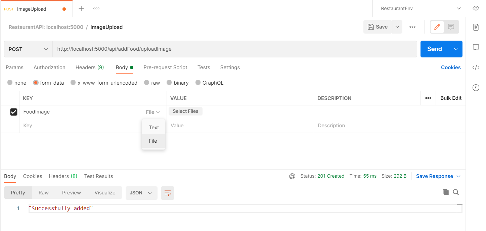

# API Documentation.

How to upload test image using Postman.
===================

This image should suffice.
1. Create new request with a name, upload image for example.
2. Choose POST request.
3. Enter `http://localhost:5000/api/addFood/uploadImage`
4. Select Body.
5. Enter exact Key: "FoodImage", choose type file.
6. Value: select image from file.
7. Send request


How to Use Add Dish API
===================
This is an example.
```javascript
// ...
{
    // ...
    const data = {
        foodID,
        name,
        price,
        type,
        
        /*  Actual Uploaded Image file field below.
         *  for example, from <input type="file" ... / >,...
         */
        FoodImage,
        
        description,
        avail
    };
    let formData = new FormData();
    for (let name in data) {
        formData.append(name, data[name]);
    }

    // Temporaty path, might be changed later.
    fetch("/api/addFood/addFood", {
        method: "POST",
        // should be authorized header
        // or authenticate header something.
        header: {
            // ...
        },
        body: formData
    })
        .then(res => {
            if (res.ok) {
                // ...
            }
            return res.json();
        })
        .then(res => {
            // ... 
        });
    // ...
}
// ...
```

